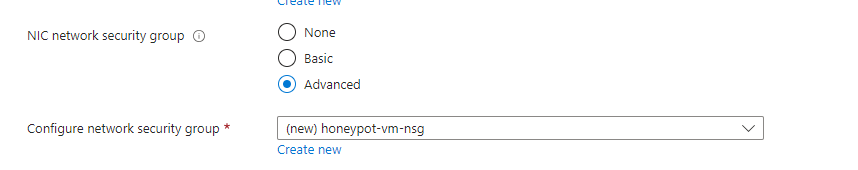
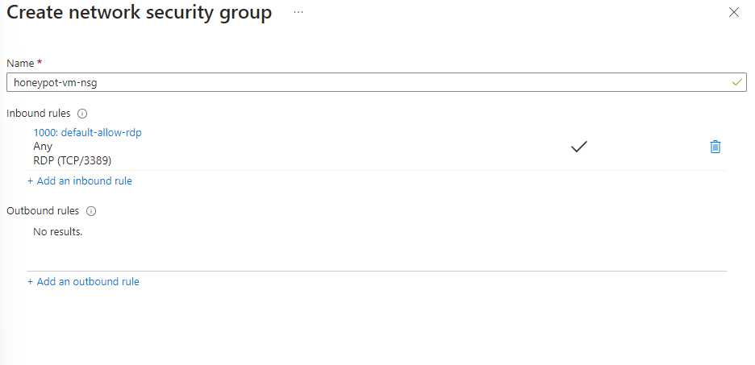
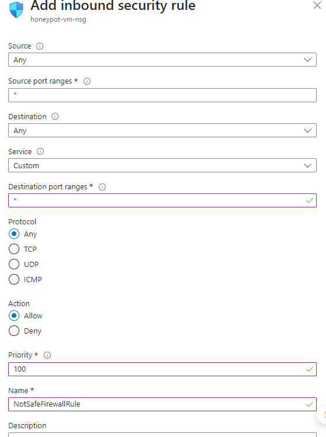
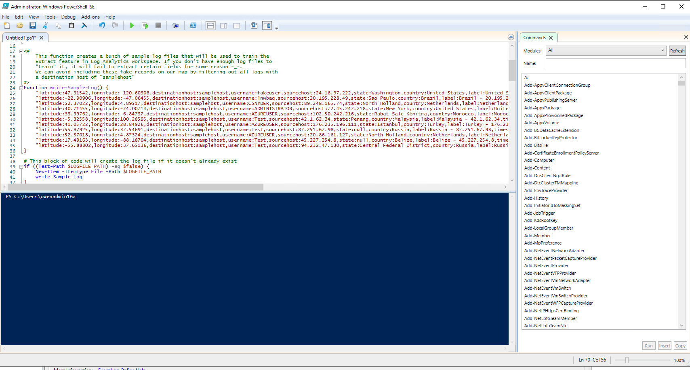
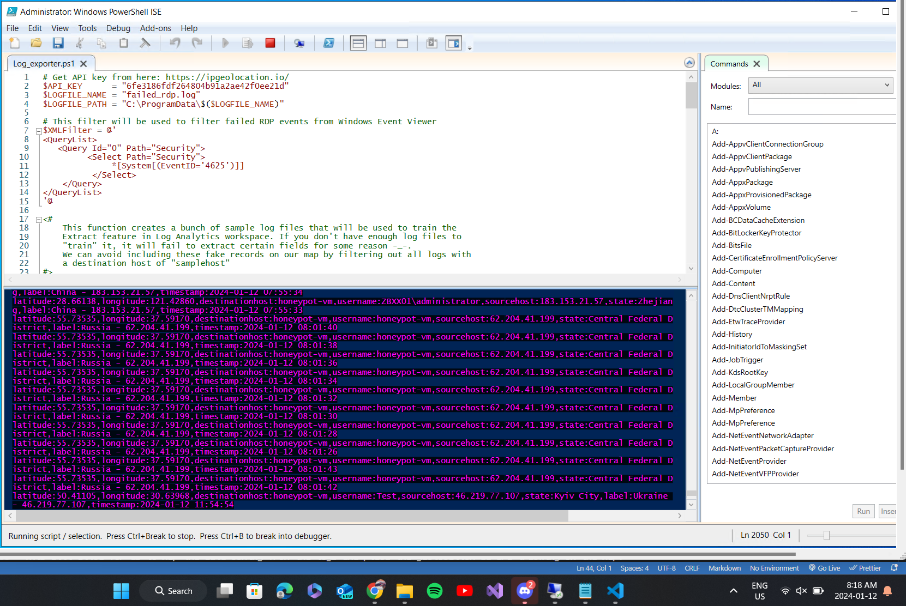
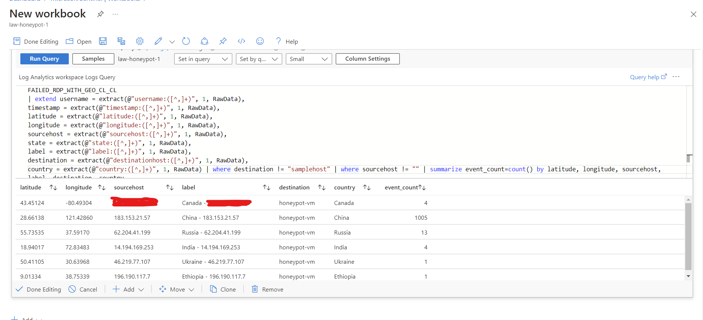
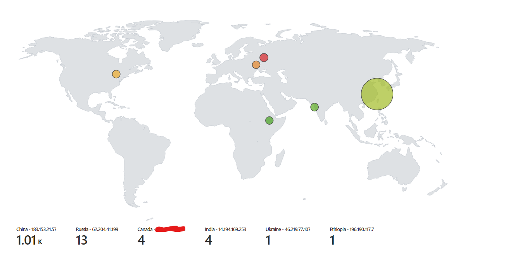
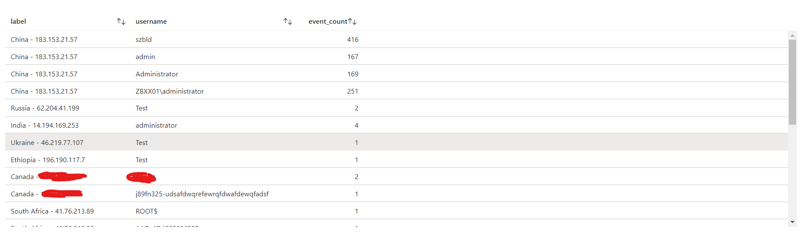
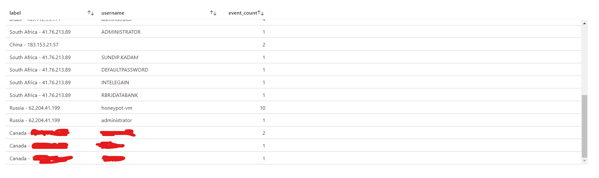

# Azure-Sentinel-SIEM

## Introduction

In an era dominated by digital advancements, cybersecurity has become an ever-pressing concern. As part of our commitment to fortifying digital defenses, I built a project that seamlessly integrates Azure cloud services with the strategic deployment of honeypots. The objective? To not only detect potential threats but also to visually represent the cyber landscape by geolocating external actors attempting unauthorized access.

## Project Overview

Our project revolves around the establishment of a honeypot, a deceptive system designed to lure potential attackers, hosted on the Microsoft Azure cloud platform. Leveraging the robust capabilities of Azure, we created an intricate network infrastructure that mirrors the complexity of real-world systems, making it an enticing target for cyber adversaries.

## Future Plans

- I did explore the list of usernames used but the windows event viewer is a extensive logging tool so there is lots of events I could be tracking to visualize.
- I have a plan to work with more SIEM based projects specifically using Linux and the Elastic tech stack.
- https://github.com/telekom-security/tpotce

# Notes
## Azure:

Free trial
Try Microsoft Sentinel free for the first 31 days. Microsoft Sentinel can be enabled at no additional cost on an Azure Monitor Log Analytics workspace, subject to the limits stated below.

New workspaces can ingest up to 10GB/day of log data for the first 31-days at no cost. Both Log Analytics data ingestion and Microsoft Sentinel charges are waived during the 31-day trial period. This free trial is subject to a 20 workspace limit per Azure tenant.
Usage beyond these limits will be charged per pricing listed on this page. Charges related to additional capabilities for automation and bring your own machine learning are still applicable during the free trial.

https://azure.microsoft.com/en-ca/pricing/details/microsoft-sentinel/#:~:text=Microsoft%20Sentinel%20can%20be%20enabled,31%2Ddays%20at%20no%20cost.

## The Process:

We are going to open up a VM and turn off all firewall rules (_Unrecommended_), but for the lab it is what we want to do so that the world wide hackers will be able to identify the machine and begin trying to hack into it.

### Azure Account.

### VM Setup.

Create a virtual machine, turn off the external azure firewall and turn off the internal windows firewall for the VM. This will make it very easy to detect and cause more hackers to detect it and try to break into it, but since we are making a honeypot it is good so that we can detect all of the people trying to break into the system.

new firewall config

remove everything from this firewall we gotta make it unsafe

adding these rules to allow anything

Got the VM setup and remooved the windows fire wall, now we are going to need to be viewing the Event Viewer so we can grab our authenication logs.

Each login attempt we are going to use Event Viewer to log each one and then we can grab an IP address from that event then map it to our global map but we gotta an API for that and that is where ipgeolocation comes in.

Loaded in a powershell program that will use the logs and then use the API to geolocate every login attempt so we can monitor.

After approximate 8hours I have noticed that russia and china picked up the box.

.

### Log repository inside Log Analytics Workspace

Now that the logs are filling out because Russia and China found it I can fix up the table and logs.

The date and time is 5hours ahead of my time in eastern standard time so I am going to manipulate the logs so that they will be showing the proper time.

Extracted the data from the raw data logs

removed my public IP when I was first testing the logs

### Setup Azure Sentinel

This will allow for us to map the data coming from the logs and place the geolocation we are tracking on the map.

Final Setup, Very nice I marked out my IP.

checking out the usernames tried for each attempt

Some of the usernames and IPs are blocked that is from me testing and getting some of my friends to try it out with the logging system.
